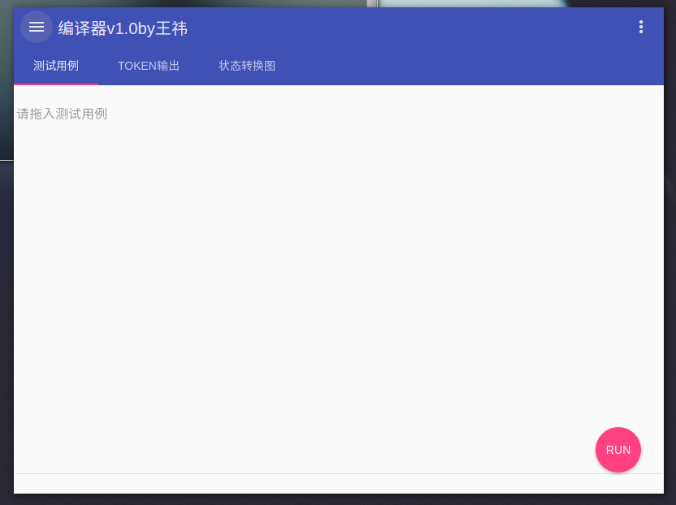
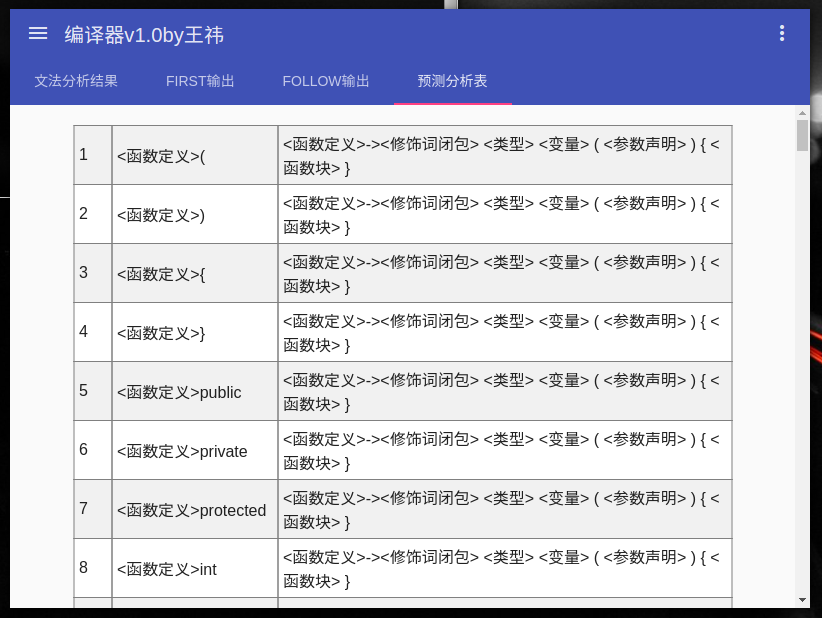
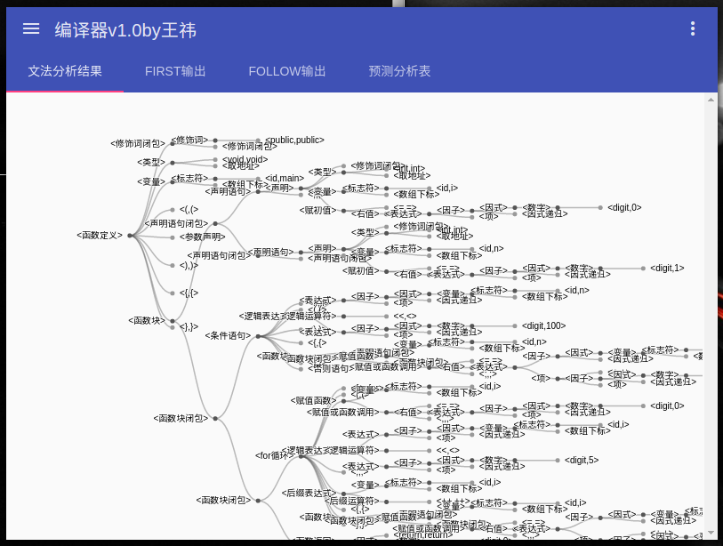
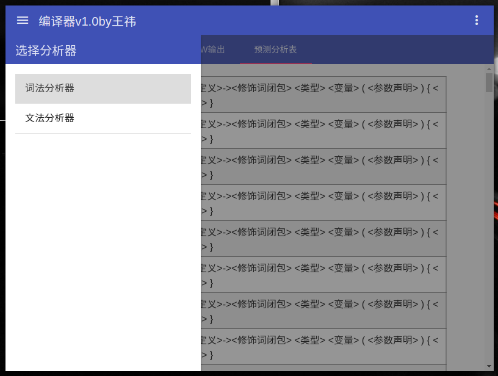

# Compiler

哈工大编译原理实验，使用node语言，实现了基于状态转换机制的词法分析器,以及自顶而下分析的语法分析器，gui基于electron&angular制作，数据可视化使用的是d3.js。

# 还有什么好说的！  
# 学弟学妹们快上车，随便拿去用！

还是多说几句吧^_^核心代码在compiler文件夹中，已经做了解耦，可以单独拿出来用。gui的渲染则在view文件夹中。代码量很少，读起来应该比较轻松，就不做说明了，想要对核心代码或者界面进行修改，只需要动这两部分的代码即可。

##运行

运行需要自行搭建node环境和npm，全局安装好electron。下面展示linux下如何使用：

>sudo apt-get install nodejs(node其实不建议这么安装，建议到官网下载)  
sudo apt-get install npm  
sudo npm install electron -g

如上环境就算都弄好了，现在展示如何运行项目：

>electron .

这样一个Material Design风格的桌面应用就运行起来了

##特性

* 支持测试用例文件直接拖入应用执行
* 全Material Design的界面设计风格

* 支持语法分析器的结果采用树状图可视化输出,树状图支持放缩和移动

* 状态表和文法表与程序流程完全解耦，可以简便的扩展词法分析器和语法分析器
* 支持前端路由

* 支持界面跟随窗口内容自适应
* 语法分析器支持三种具体情况的错误判断，并提供错误行信息。

##需要注意的问题

1.对于状态转换机制应该算是基本功了，主要需要注意的是状态转换时的终止判定：  
* 我使用的方式是判断输入和当前状态的二元对在不在状态转换表内，如果不在且当前状态是终止状态，则认为是终止状态，可以重置状态机。
* 另外一种方式是使用界符，但是这种方式需要单独维护界符的数据结构，增加了判定终止状态的复杂度。

2.关于查错也有两种方式：  
* 简单的方法是不在状态转换机就是出错，这种方法非常简单，但是不能够得到具体的报错信息，同时如果采用这种方式，判定终止条件的方式则需要使用界符。
* 另外一种方法则是将报错维护在状态转换机中，这样可以获得具体的报错信息，但是状态转换图的复杂度当然也相应增加。

3.关于状态转换图：  
* 本项目的状态转换基于一个自己攒出来的状态转换表，大概囊括了40个左右的终止状态，反正实验内容要求的那些应该没有问题。  
* 状态转换表的结构分为5个字段，分别是S(状态集合)，I（输入集合），T（转换表），SS（起始状态），FS(终止状态集合)。  
T的格式则是{S:{I:S...}...}这种json格式，整体的字段格式也是json，解析起来还是非常容易的。  
* 值得注意的是这个转换表其实有些繁琐了，主要是按照老师的ppt定的状态转换机的这5个输入，写完之后反思觉得其实没必要这么麻烦，S和I都是不必要的。
